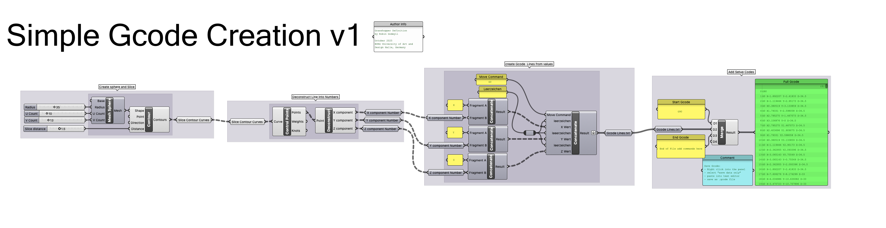

# Simple Gcode Creation in Grasshopper 

Grasshopper Definition herunterladen: [SimpleGcodeCreation01.gh](https://github.com/robin-gdwl/docs/raw/refs/heads/main/docs/Courses/Explorations_in_CNC/assets/SimpleGcodeCreation01.gh)

Diese Grasshopperdefinition zeigt eine vereinfachte Methode zum erstellen von Gcode von einem Mesh. 

Das Mesh wird mit der "Contour" Komponente in horizontale Kurven unterteilt.  
Die Kontrollpunkte der Kurven werden extrahiert und in X, Y und Z Koordinaten umgewandelt.  
Anschließend werden die Koordinaten in Gcode Befehle umgewandelt und erhalten einen G0 Move Befehl. 

