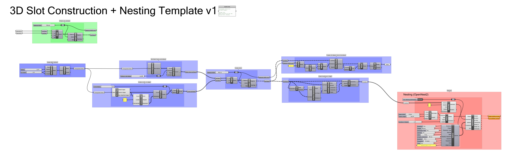

# 3D Slot Construction + Nesting 

Dieses Template ermöglicht das Erstellen von 3D Steckverbindungen in Grasshopper.

Grasshopper Definition herunterladen: [3DSlotConstruction01.gh](https://github.com/robin-gdwl/docs/raw/refs/heads/main/docs/Courses/Explorations_in_CNC/assets/3DSlotConstruction01.gh)

## Overview-Tutorial:
<iframe width="560" height="400" src="https://www.youtube-nocookie.com/embed/JzR71XaZlNY?si=sj5NvVAUavneTAyw" title="YouTube video player" frameborder="0" allow="accelerometer; autoplay; clipboard-write; encrypted-media; gyroscope; picture-in-picture; web-share" referrerpolicy="strict-origin-when-cross-origin" allowfullscreen></iframe>

Für Slot Construction ist auch das Plugin [BowerBird](https://www.food4rhino.com/app/bowerbird) hilfreich. Es Vereinfacht die Erstellung von Querschnittflächen.

<iframe width="768" height="496" src="https://miro.com/app/live-embed/o9J_lY664nQ=/?focusWidget=3458764646125764684&embedMode=view_only_without_ui&embedId=588036734826" frameborder="0" scrolling="no" allow="fullscreen; clipboard-read; clipboard-write" allowfullscreen></iframe>

