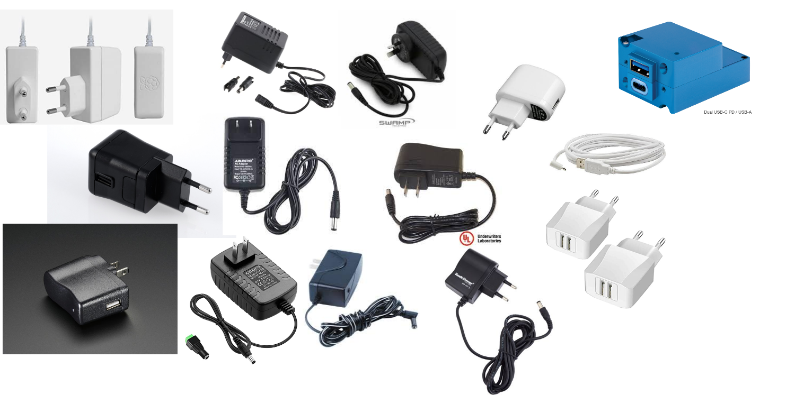

# Session 03: "Echte Objekte Modellieren

In dieser Session geht es darum "echte" Objekte nach Vorlage zu modellieren.  
In der Hausaufgabe der letzten Wochen haben wir bereits mit Referenzen gearbeitet, diesmal geht es or allem darum zu planen, wie ein Modell aufgebaut werden kann. 

## Die Aufgabe für die Heutige Session

Schnapp dir einen Gegenstand der nicht zu simpel aber auch nicht zu komplex ist. Ein Stromstecker funktioniert sehr gut. 

Überlege, wie du dieses Objekt modellieren kannst:
- Welche **Grundkörper** gibt es? 
- Wie kannst du die Form in Fusion bauen?
- Reicht eine Extrusion um die Form zu erstellen oder braucht es **Lofts**, **Revolve** oder **Sweeps**?
- Wie kannst du Schrägen, Winkel und Abrundungen einbauen?
- Welch Details gibt es an der Form und wie können diese modelliert werden? 

Modelliere das Objekt, achte dabei vor allem auf Abhängigkeiten zwischen Körpern und Skizzen sowie auf die Reihenfolge der Aktionen. Genaue Maße sind nicht wichtig. 

Falls du stecken bleibst, probiere andere Tools aus oder geh noch mal 2-3 Schritte zurück. 

______

Zuletzt Aktualisiert: 
{docsify-updated}
